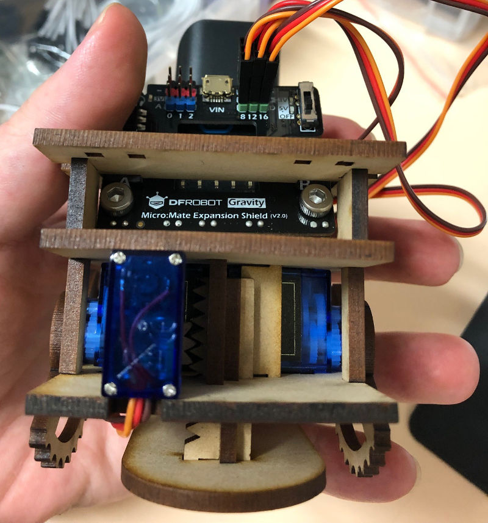
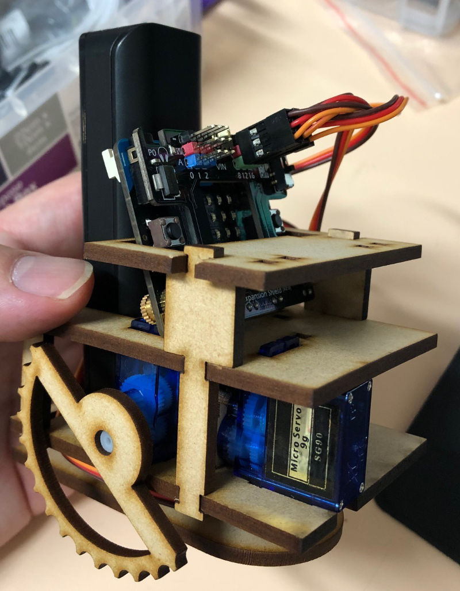
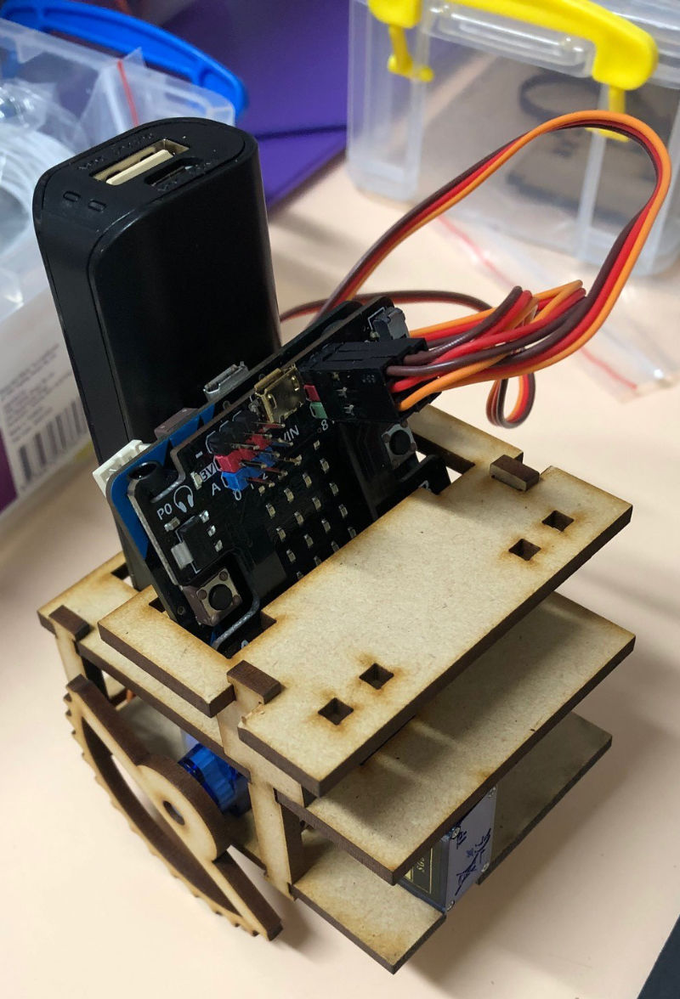

# Knuckle Dragger

This is a laser cut robot using regular servos rather than the more expensive continual rotation that is typically found in small robots like this.

I've affectionally named it the Knuckle Dragger, since that's what the sort of motion seems like to me. It uses a BBC Micro:bit and a DFRobot Micro:mate addon board as the microcontroller, and carries around a small power bank on the back.

It uses three servos:
- One for each side for forward motion attached to toothed half-wheels
- One underneath for elevating the robot so the half-wheels can reset

I used a variation on my linear actuator design for the elevation servo, with a 90 degree guide piece to help with alignment.

Version 2 has been updated to be a bit easier to assemble (particularly around the actuator rod) and distribute the weight on the lifter a bit better to cope with the weight of the battery.

