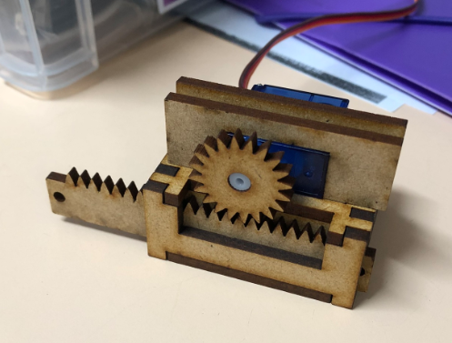
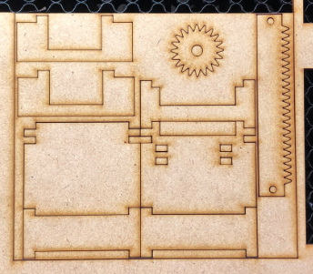

# Laser Cut Linear Actuator

This is a linear actuator I designed for laser cutting, based on some of the 3D printed models on Thingiverse. I was a bit frustrated by slow print times, and warping of plastic (particularly on the rod), so figured I'd create something that was a bit faster to produce.

I've included the DXF files if you want to cut out your own. The rod file has a couple of different lengths, and be aware that Inventor exported the construction lines I used for the teeth as vectors in the DXF, so you may need to set those lines to not cut, or manually delete them before cutting (I will get around to fixing that up and re-upload the file at some point).

