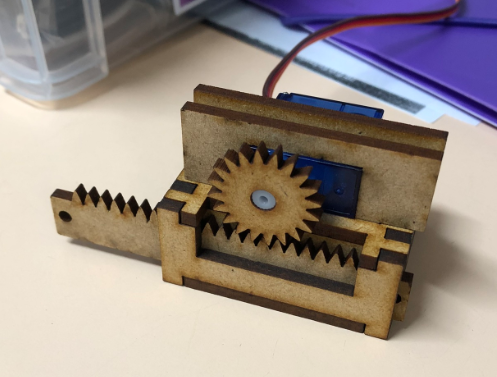
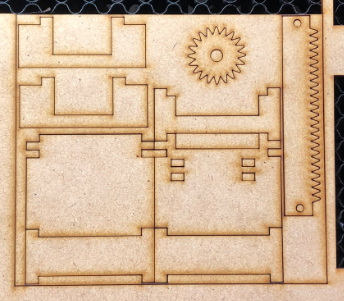

# Laser Cut Linear Actuator

This is a linear actuator I designed for laser cutting, based on some of the 3D printed models on Thingiverse. I was a bit frustrated by slow print times, and warping of plastic (particularly on the rod), so figured I'd create something that was a bit faster to produce.

I've included the DXF files if you want to cut out your own. There are two different lengths for the driver rods, which are measured from end to end (not just the geared sections).

