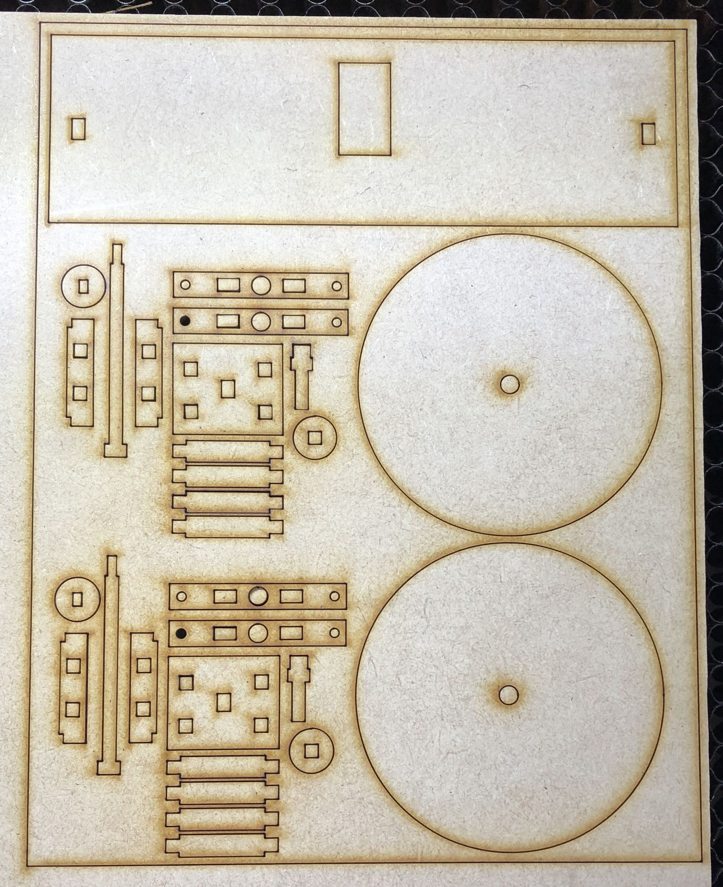
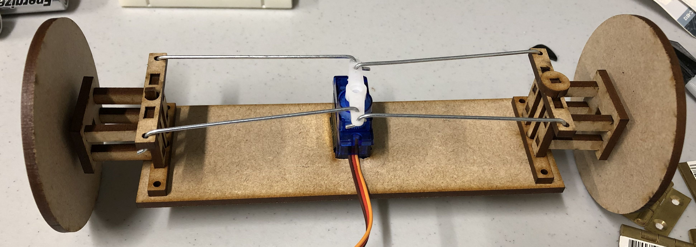

# Servo Steering
Some of my students were building a Micro:bit controlled car, and needed a steering assembly. I had seen some around on some of the kit sites, but it was at a time of the year when we were supposed to have spent all of our departmental budget, and frankly the lead time would have gotten in the way.

I had vague memories of how steering servos worked from pulling apart a (fairly expensive) remote controlled car when I was a kid, so I figured I would make my own on the laser cutter. I thought I would have to sand down some edges of the MDF so that the joins would roll smoothly, but apparently it works Just Fine with square pegs in round holes. Who knew?

Anyhow, here are some plans I drew up in Adobe Illustrator and exported to DXF for our laser cutter. It's based on 3mm MDF, so if you want to use another material all the joins will have to be re-dimensioned.

